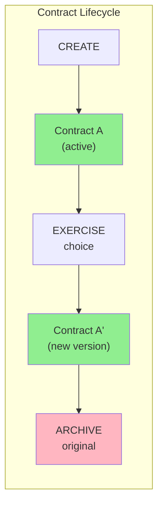
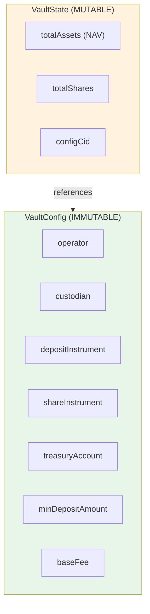
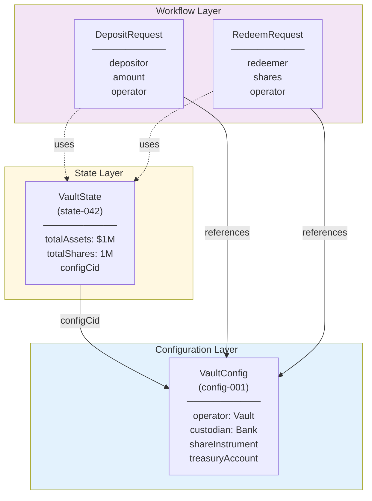
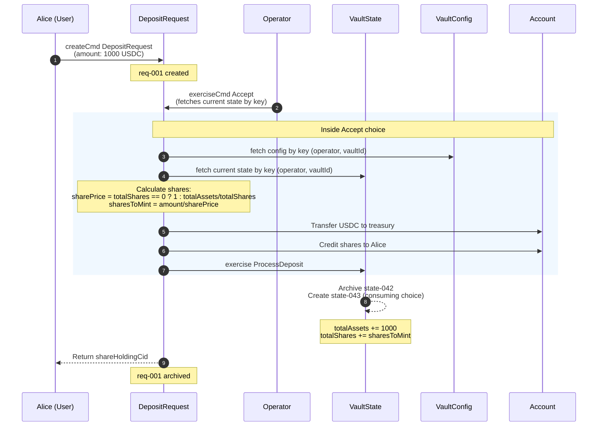
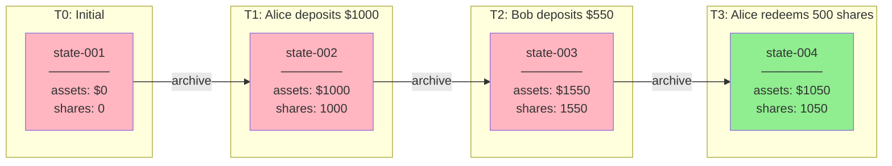
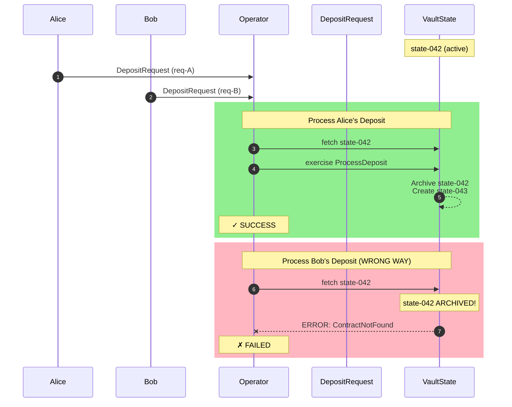
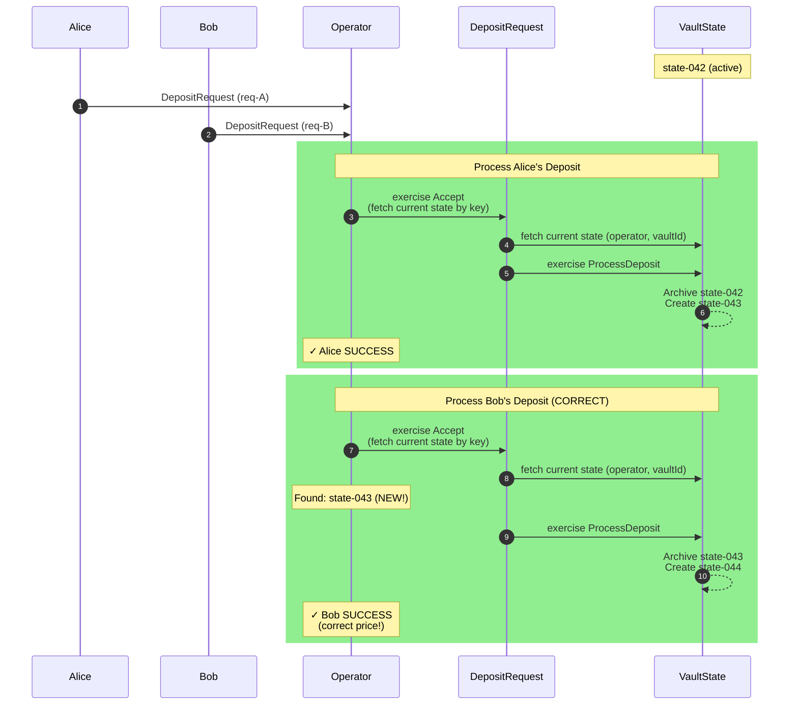
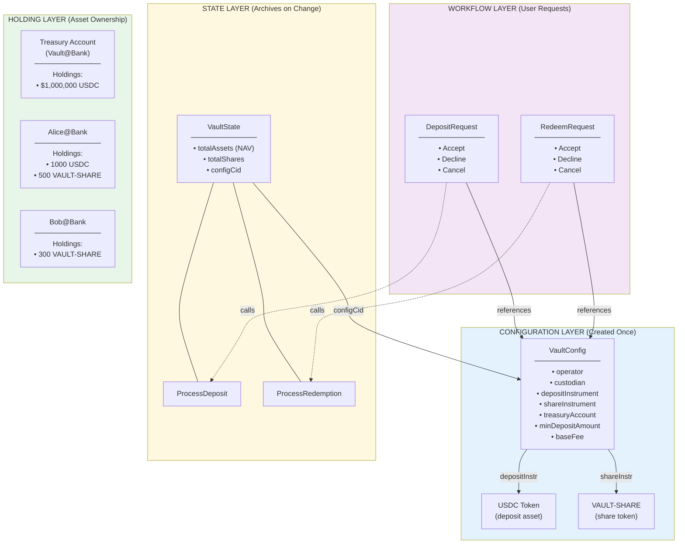

# Vault Architecture: Config vs State Pattern

## 1. DAML Contract Lifecycle

> Contract A is **ARCHIVED**, Contract A' is **CREATED** - they have different ContractIds

---

## 2. Config vs State Separation

| Property | VaultConfig | VaultState |
|----------|-------------|------------|
| Lifecycle | Created once | Archived & recreated on every mutation |
| Changes | Rarely | Frequently |
| Reference | By ContractId | Query for current active |

---

## 3. Contract Relationships

---

## 4. Deposit Flow

---

## 5. State Evolution Timeline (current code)

> Only **state-005** is active. Previous states are archived (ledger history).

---

## 6. Race Condition Scenario (Without Proper Handling)

---

## 7. Concurrent Deposits (Correct Handling)

> **Key**: Always query for CURRENT state inside the choice, never cache stale ContractIds.

---

## 8. Complete Vault Architecture

---

## 9. Summary Table

| Aspect | VaultConfig | VaultState |
|--------|-------------|------------|
| **Changes** | Rarely (upgrade scenarios) | Every deposit/redeem |
| **ContractId** | Stable, can be stored | Changes constantly |
| **Signatories** | operator, custodian | operator, custodian |
| **Purpose** | "What is this vault?" | "What is the vault's current position?" |
| **Referenced By** | VaultState, all Requests | Current operations only |
| **Archive Frequency** | Almost never | Very frequently |
| **Query Pattern** | By key or stored ContractId | Always query for CURRENT active |

---

## Key Insight

> **Config is the vault's identity. State is the vault's balance sheet.**
>
> You wouldn't change a fund's legal structure (config) every time someone deposits.
> But you do update the vault's state as deposits and redemptions occur.
